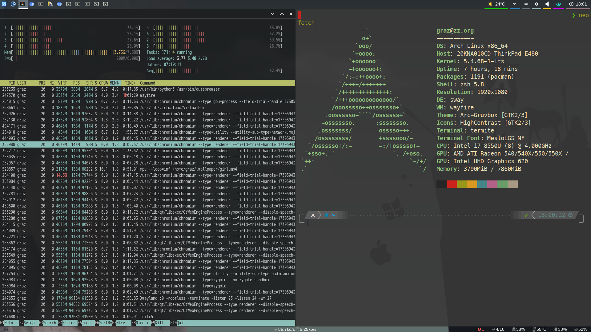
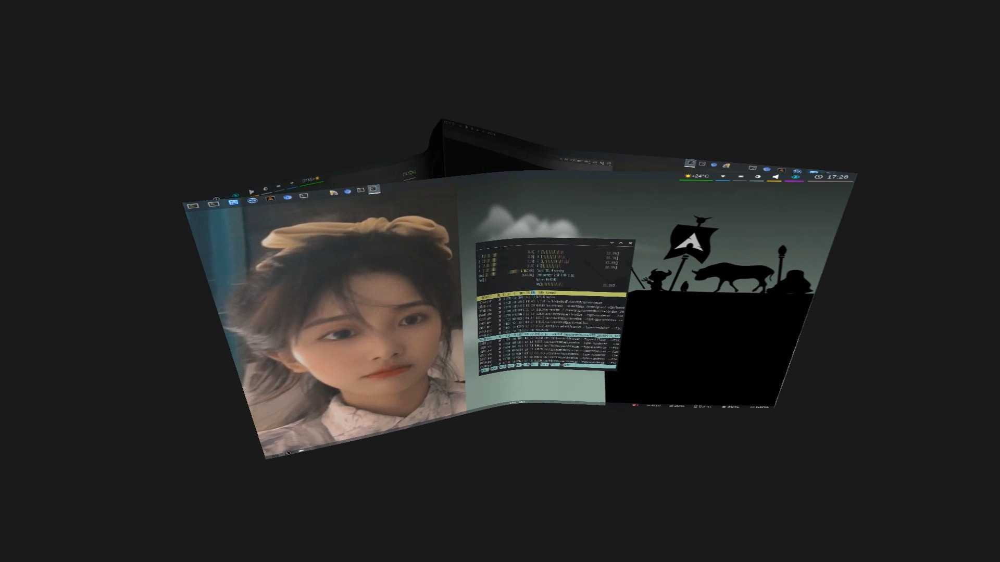
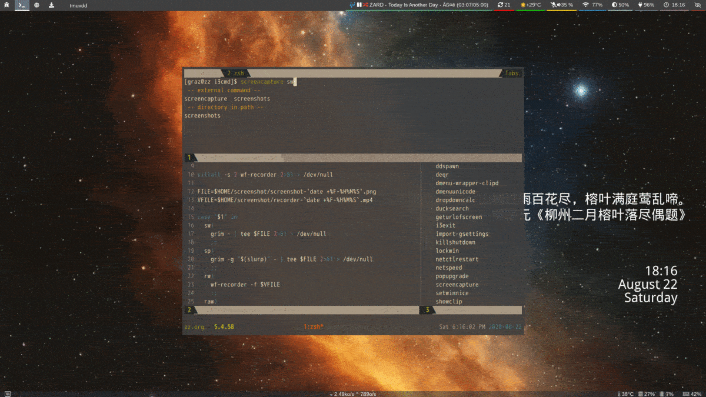

# graz's dotfiles

## requirement font-ttf
```
yay -S ttf-dejavu-sans-mono-powerline-git nerd-fonts-source-code-pro
```

## Install

```sh
./install.sh
```

## Apps

A list of applications that I use:

- [sway](https://swayawm.org/) - a tiling window manager
- [wayfire](https://wayfire.org/) -  3D compositor inspired by Compiz and based on wlroots.
- [zsh](https://www.zsh.org/) - zsh shell
- [termite](https://github.com/thestinger/termite) - A keyboard-centric VTE-based terminal
- [neovim](https://neovim.io/) - Vim-fork focused on extensibility and usability
- [ranger](https://ranger.github.io/) - an ncurses based file manager with vi like key bindings
- [vimiv](http://karlch.github.io/vimiv/) - An image viewer with vim-like keybindings
- [qutebrowser](https://qutebrowser.org/) - qutebrowser is a keyboard-focused browser with a minimal GUI.

## Screenshots





## Video

- [](https://youtu.be/NdQ_W1NEeIw "ArchLinux使用Wayfire配置的桌面效果") 点击图片跳转Youtube观看视频效果
- [](https://www.bilibili.com/video/BV1Ta4y177VS/ "ArchLinux使用Wayfire配置的桌面效果") 点击图片跳转Bilibili观看视频效果
