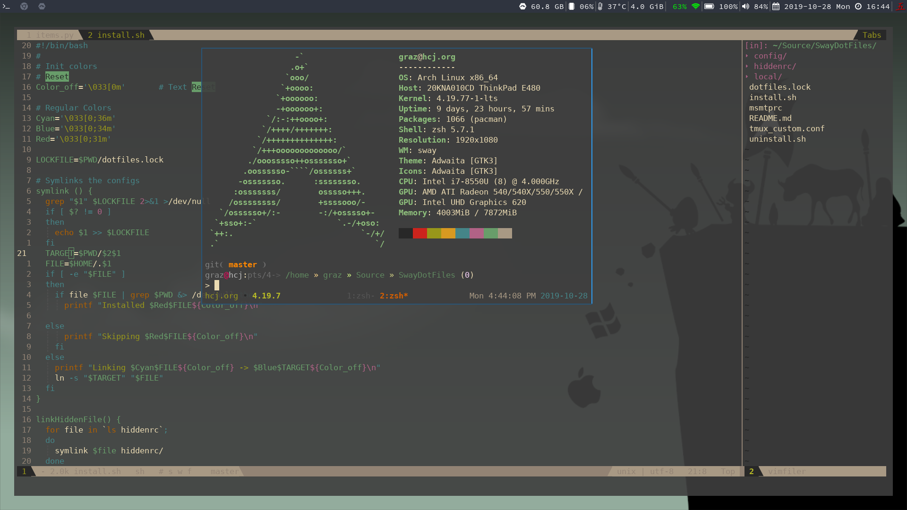
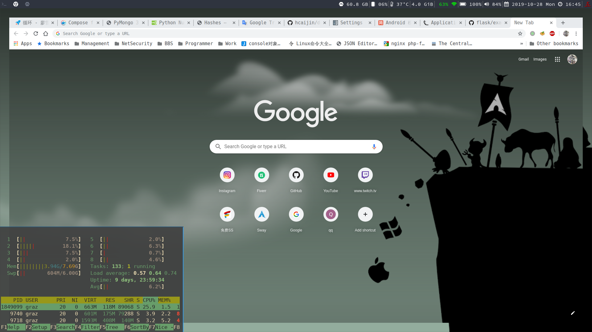

# graz's dotfiles

## requirement font-ttf
```
yay -S ttf-dejavu-sans-mono-powerline-git nerd-fonts-source-code-pro
```

## Install

```sh
./install.sh
```

## Apps

A list of applications that I use:

- [sway](https://swayawm.org/) - a tiling window manager
- [oh-my-zsh](https://github.com/robbyrussell/oh-my-zsh) - zsh shell
- [termite](https://github.com/thestinger/termite) - A keyboard-centric VTE-based terminal
- [neovim](https://neovim.io/) - Vim-fork focused on extensibility and usability
- [vifm](https://vifm.info/) - an ncurses based file manager with vi like key bindings
- [vimiv](http://karlch.github.io/vimiv/) - An image viewer with vim-like keybindings

## Screenshots





